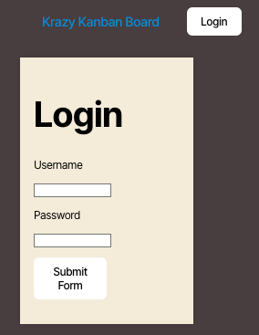

# KanbanBoard

[](https://opensource.org/licenses/MIT)

## Description
This Kanban board application provides a secure and user-friendly platform for managing tasks and workflows. It features a secure login page using JSON Web Tokens (JWT) to authenticate users and ensure secure access. Key functionalities include login authentication, session management, and ticket organization.

**[View the deployed application here]()**



## Features

- **Secure Login:** Users are required to enter a valid username and password to access the Kanban board.
- **JWT Authentication:** Ensures secure and efficient authentication. Tokens are stored securely in local storage for subsequent requests.
- **Error Handling:** Invalid login attempts trigger an error message.
- **Session Management:** Sessions expire after a period of inactivity, ensuring security.
- **Logout Functionality:** Users can log out, which removes the JWT from local storage and redirects them to the login page.

## Installation
1. Clone the repository:
   ```bash
   git clone https://github.com/your-username/kanban-board.git
2. Navigate to the project directory: 
    ```bash 
    cd kanban-board
3. Install dependencies: 
    ```bash
    npm install
4. Set up environment variables: Create a .env file in the root directory with the following variables: 
    ``` bash
    JWT_SECRET=your_jwt_secret
5. Start the development server: 
    ```bash
    npm run start:dev

## Usage
Login
1. Open the application in your browser.
2. Enter your username and password on the login page.
3. If valid credentials are provided, you will be redirected to the Kanban board page.
4. If invalid credentials are provided, an error message will appear.

Task Management
- Add, edit, and move tasks between columns on the Kanban board to organize your workflow.

Logout
- Click the "Logout" button to end your session and return to the login page.

Session Expiry
- Sessions expire after a defined period of inactivity. After expiration, you will be redirected to the login page upon your next action.

## Technology Stack
- Frontend: React, TypeScript, CSS
- Backend: Node.js, Express
- Authentication: JSON Web Tokens (JWT)
- Database: PostgreSQL (or your choice of database)

## License
This project is licensed under the MIT License. See the LICENSE file for details.